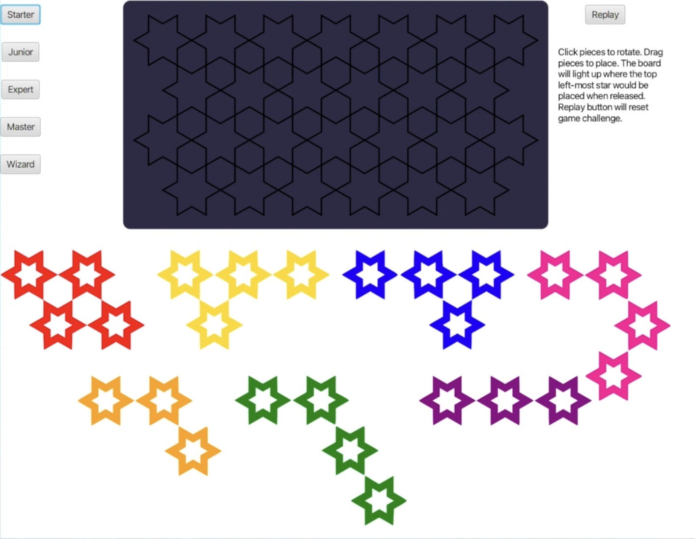
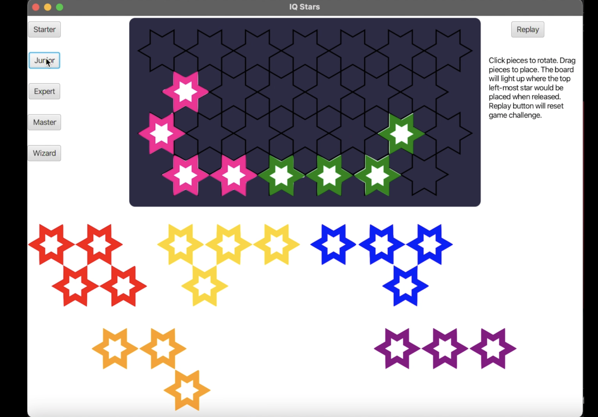
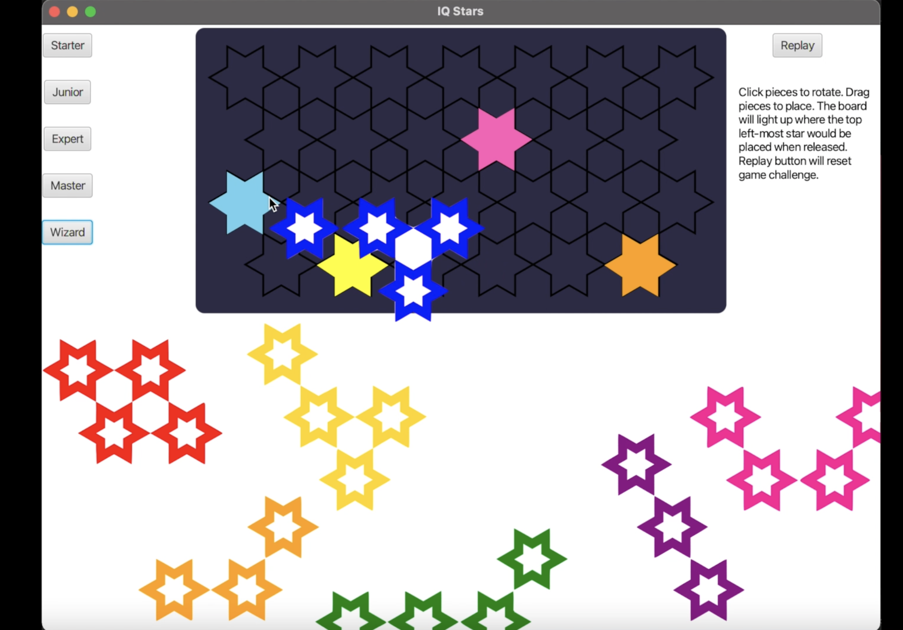
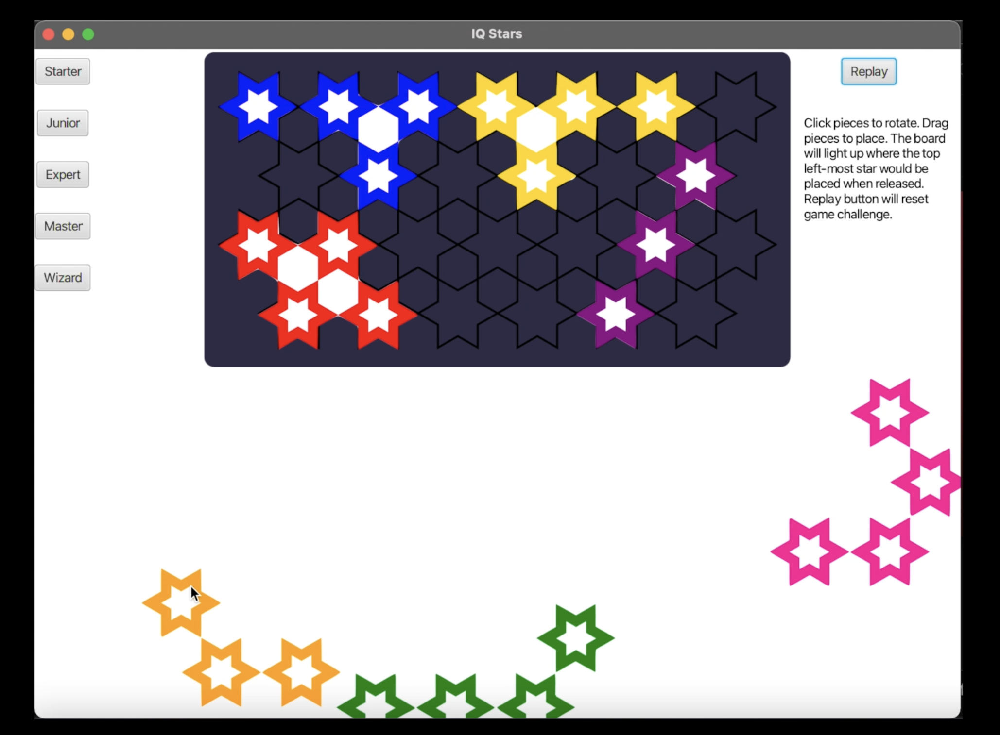

# IQ Stars

This is the **project I did with two other teammates Benjamin Pope and Shafin Kamal** for course COMP1110 Semester 2, 2021.
  
All the image in "assets" folder are given by the course and the files in "admin" folder are modified base on the orignial templete. All the image files and templete files  credits to the original writers.  
This assignment is **not currently used** for COMP1110 students.

## Demo pictures
### Starting page:  

 
### Choosing a difficulty level:  

 
### Playing the game:
  
 

